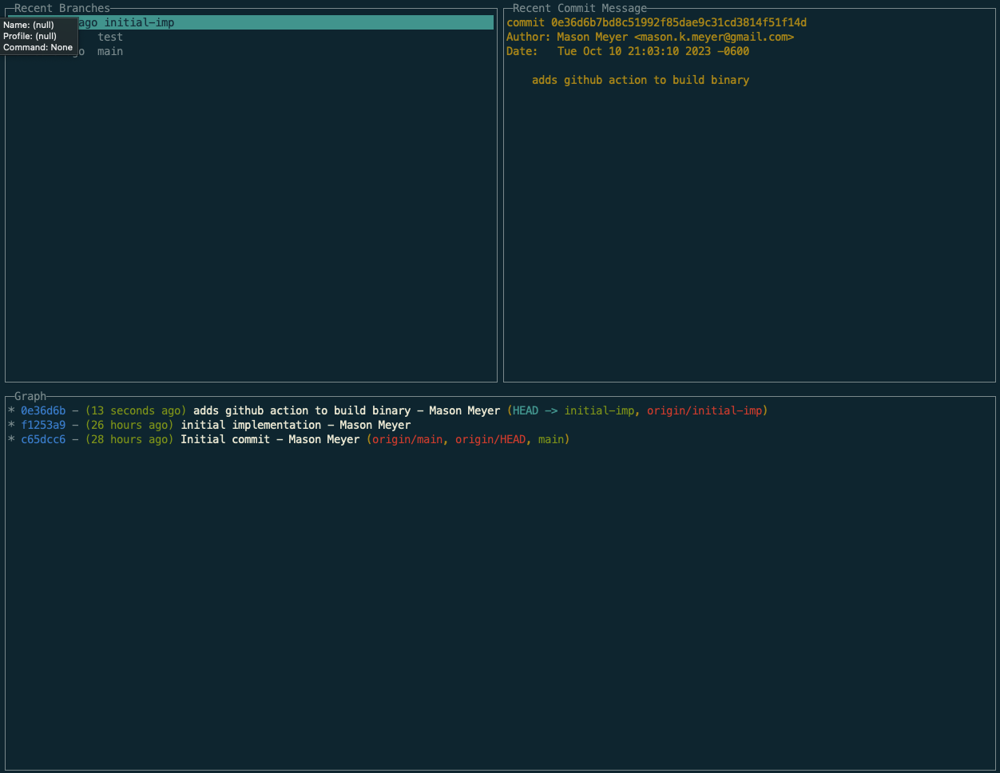

# Jet 

A tool for quickly switching branches in git. Jet organizes orders your branches by recent commits, displays the most recent commit message, and the branch graph. You can easily switch to a branch by clicking enter.



```bash
git config --global alias.jet '!jet'
```